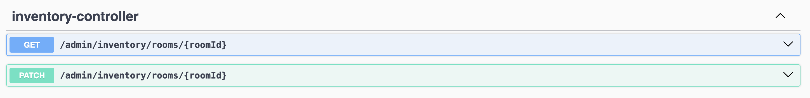
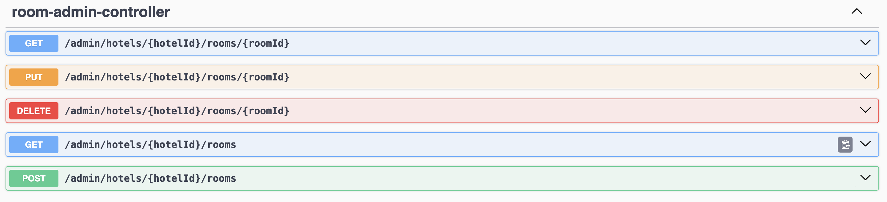
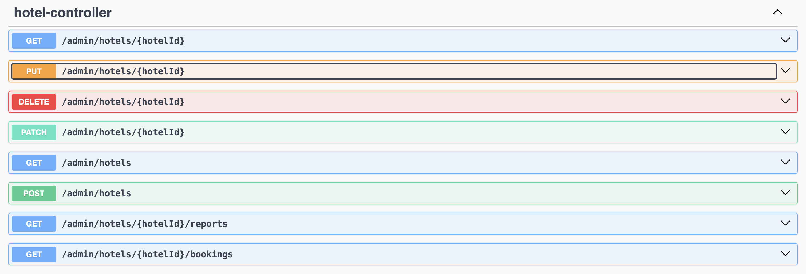
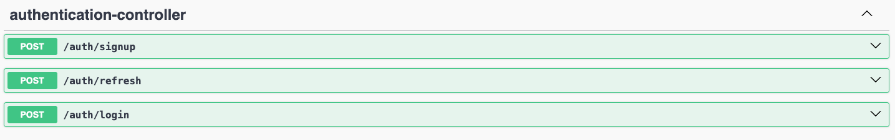
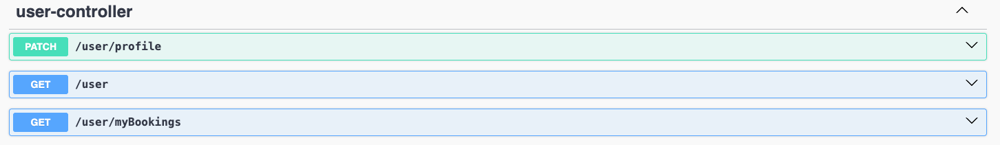
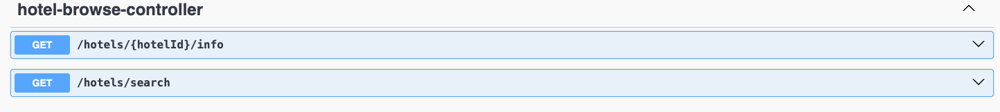
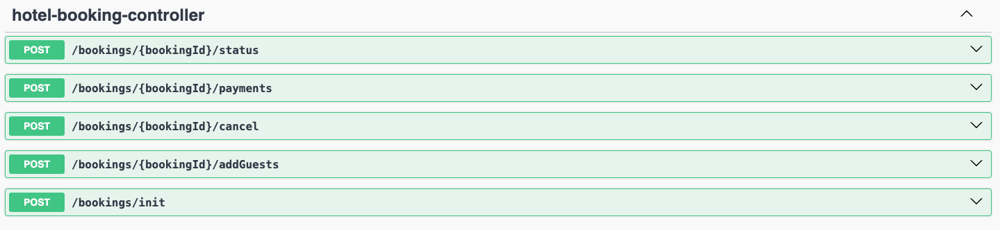
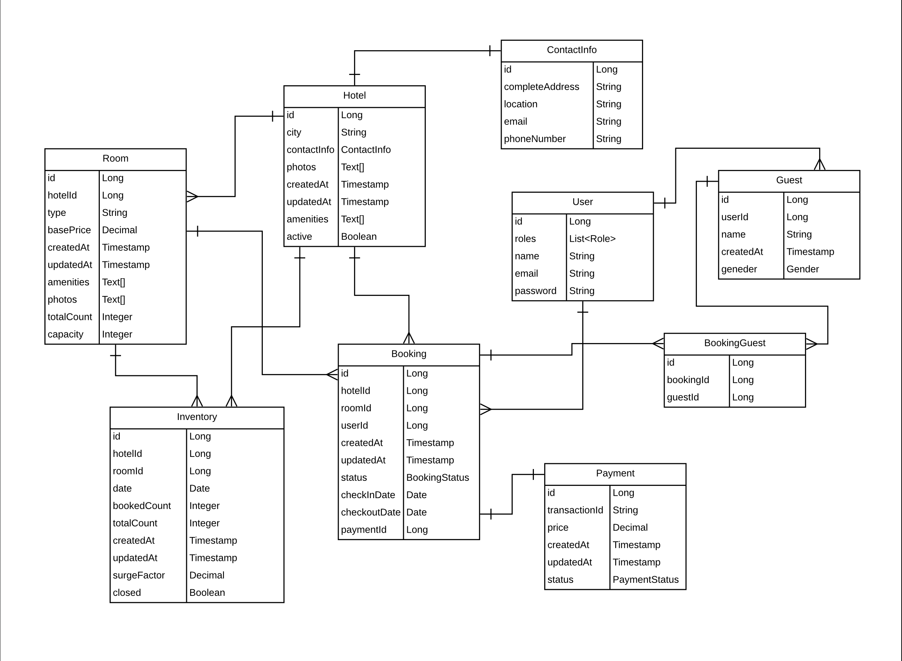

# AirBnb Backend API

This application provides backend APIs for a hotel management system, including inventory management, booking flow, user authentication, and hotel browsing.

## Features

### Admin Inventory
- **GET** `/admin/inventory/rooms/{roomId}` - Retrieve inventory of a room
- **PATCH** `/admin/inventory/rooms/{roomId}` - Update inventory for a room

### Admin Room
- **GET** `/admin/hotels/{hotelId}/rooms/{roomId}` - Get a particular room from a hotel
- **GET** `/admin/hotels/{hotelId}/rooms` - Get all rooms from a hotel
- **POST** `/admin/hotels/{hotelId}/rooms` - Create a room for a hotel
- **PUT** `/admin/hotels/{hotelId}/rooms/{roomId}` - Update a room for a hotel
- **DELETE** `/admin/hotels/{hotelId}/rooms/{roomId}` - Delete a room for a hotel

### Admin Hotel
- **GET** `/admin/hotels/{hotelId}` - Get a hotel
- **GET** `/admin/hotels` - Get all hotels
- **GET** `/admin/hotels/{hotelId}/bookings` - Get all bookings for a hotel
- **GET** `/admin/hotels/{hotelId}/reports` - Get report for a hotel
- **POST** `/admin/hotels` - Create a hotel
- **PATCH** `/admin/hotels/{hotelId}` - Active the hotel
- **PUT** `/admin/hotels/{hotelId}` - Update a hotel
- **DELETE** `/admin/hotels/{hotelId}` - Delete a hotel

### User Authentication
- **POST** `/auth/signup` - User signup
- **POST** `/auth/refresh` - Refresh access token
- **POST** `/auth/login` - User login

### User Profile
- **GET** `/user` - Get the user profile
- **GET** `/user/myBookings` - Get all the bookings for the user
- **PATCH** `/user/profile` - Update the user profile

### Browse about the hotels
- **GET** `/user/{hotelId}/info` - Get about a particular hotel
- **GET** `/user/search` - Search about the hotel based on availability and all

### Book the hotel
- **GET** `/hotels/search` - Search for a hotel based on date and location
- **GET** `/hotels/{hotelId}/info` - Get about a particular hotel for users
- **POST** `/bookings/init` - Initiate a new booking
- **POST** `/bookings/{bookingId}/addGuests` - Add guest to a booking
- **POST** `bookings/{bookingId}/payments` - Initialize for a payment
- **POST** `/user/{hotelId}/info` - Cancel a booking
- **POST** `/bookings/{bookingId}/status` - Get the booking status

### Webhook for capture payments
- **POST** `/webhook/payments` - Webhook for capture payments

**## Database Schema for the whole application**

